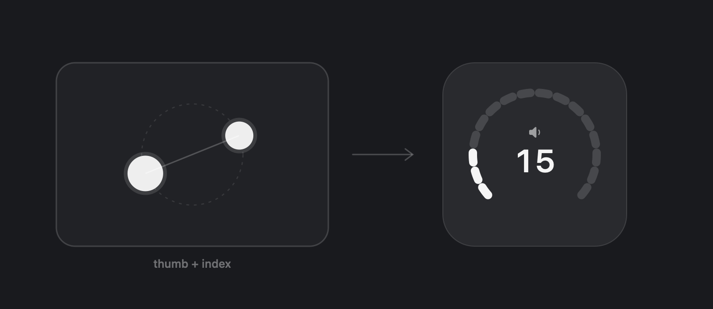

# TwistPad

Twist two fingers on your trackpad like you're turning a dial, and the volume follows. Thumb and index works best.

It clicks as it turns. 16 haptic detents across the range, so it feels like a knob instead of a gesture.



## Install

```bash
brew install --cask Toxic880/tap/twistpad
```

Or grab the zip from [Releases](https://github.com/Toxic880/TwistPad/releases/latest), unzip it, and drag TwistPad to Applications.

Signed and notarized by Apple, so it just opens. No warnings, nothing to allow, no permissions to grant. It lives in the menu bar and needs macOS 14 or newer and a trackpad.

Building it yourself works too:

```bash
git clone https://github.com/Toxic880/TwistPad.git
cd TwistPad
./build.sh
open TwistPad.app
```

## How it feels

Your wrist is the limit here, not the software. A natural twist runs about 60°, so a full sweep from silent to max is set to 70° by default. One comfortable turn covers the whole range and you never have to re-grip.

* Clockwise turns it up, like every volume knob ever made. Flip it in settings if you're wired backwards.
* 16 detents, the same steps as the volume keys. Haptic tick on each one, and a firmer tap at 0 and 100 so you feel the ends without looking.
* The first 8° of twist does nothing on purpose, so a stray scroll never nudges your volume.
* The on-screen dial is segmented, one chunk per detent. What lights up is exactly what you just felt click.

Sensitivity, detent count, direction and the app blacklist are all in settings, along with a live readout of how far you're twisting so you can find your own feel.

## How it knows you meant it

Two fingers on a trackpad are ambiguous, so a twist has to clear three checks before it takes over: enough rotation, fingers that stay put instead of sliding across the pad, and a thumb-and-index stance rather than a narrow scroll. Fail any one of them and that touch is ignored until you lift off.

Apps that use rotation themselves, like Preview, Photos and Figma, are excluded by default so it stays out of their way. That list is editable in settings.

## Problems?

Email **Support@traluco.com** with **TwistPad** in the subject line.

## License

MIT. Do whatever you want with it.
